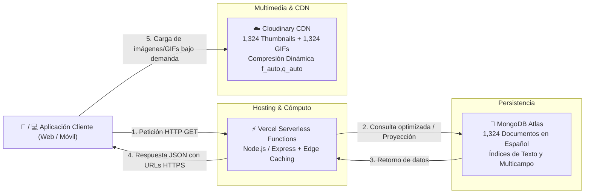

<div align="center">

# 🏋️ Exercises Dataset RESTful API

**Una API RESTful serverless moderna, escalable y de alto rendimiento que proporciona acceso a un catálogo de 1,324 ejercicios físicos con recursos multimedia optimizados (Cloudinary CDN) y soporte completo en español.**

[](https://exercises-dataset.danielvasquez.lat/api/v1/health)
[](https://exercises-dataset.danielvasquez.lat/api/v1/exercises)
[](https://cloud.mongodb.com/)
[](https://cloudinary.com/)
[](https://vercel.com/)
[](LICENSE)

**🌐 URL Base de Producción:**  
### [`https://exercises-dataset.danielvasquez.lat/api/v1`](https://exercises-dataset.danielvasquez.lat/api/v1)

</div>

---

## 📋 Tabla de Contenidos

- [Contexto del Proyecto](#-contexto-del-proyecto)
- [Características Principales](#-características-principales)
- [Stack Tecnológico y Arquitectura](#-stack-tecnológico-y-arquitectura)
- [Primeros Pasos y Quickstart](#-primeros-pasos-y-quickstart)
- [Referencia de Endpoints](#-referencia-de-endpoints)
- [Estructura del Proyecto](#-estructura-del-proyecto)
- [Desarrollo Local y Scripts](#-desarrollo-local-y-scripts)
- [Mantenimiento y Buenas Prácticas](#-mantenimiento-y-buenas-prácticas)
- [Licencia y Créditos](#-licencia-y-créditos)

---

## 💡 Contexto del Proyecto

Originalmente, este repositorio contenía más de **155 MB** de datos estáticos acoplados (`images/`, `videos/`, `data/exercises.json`). 

Para permitir que cualquier frontend (web o aplicación móvil) consuma la información de forma dinámica y eficiente sin cargar archivos pesados en el cliente, se desacopló el proyecto migrándolo a una **arquitectura Serverless en la nube**:

* **Imágenes y GIFs animados:** Alojadados y optimizados en **Cloudinary** con compresión dinámica WebP/AVIF (`f_auto,q_auto`).
* **Datos e Instrucciones en Español:** Estructurados, indexados e insertados en un cluster **MongoDB Atlas (M0)**.
* **Capa de API:** Construida en **Node.js / Express** y desplegada en **Vercel Serverless Functions** con caché global en el Edge (`s-maxage=86400`).

---

## ✨ Características Principales

* 📖 **1,324 Ejercicios Físicos:** Con nombre, grupo muscular primario y secundario, equipamiento, instrucciones continuas y pasos detallados en **Español**.
* ⚡ **Edge Caching Global:** Tiempos de respuesta menores a 25ms para peticiones cacheadas en los nodos Edge de Vercel.
* 🔍 **Búsqueda por Texto Completo (*Full-Text Search*):** Búsquedas rápidas por nombre, músculo o equipamiento.
* 🎯 **Filtros Combinables:** Filtra por `body_part`, `target`, `equipment`, `muscle_group` o `tag`.
* 📄 **Paginación Estándar:** Navegación por páginas con metadatos completos (`total`, `page`, `limit`, `total_pages`, `has_next_page`).
* 🎲 **Generador de Ejercicios Aleatorios:** Endpoint `/random` ideal para generadores de rutinas de entrenamiento.
* 🖼️ **Multimedia CDN:** Cada ejercicio incluye URLs seguras HTTPS directas a su miniatura optimizada y a su GIF animado.

---

## 🏗️ Stack Tecnológico y Arquitectura



* **Backend:** Node.js, Express, Mongoose, Dotenv, CORS.
* **Database:** MongoDB Atlas (M0 Sandbox Free Tier - 512 MB).
* **Media CDN:** Cloudinary (Free Tier - 25 GB mensuales de transferencia).
* **Despliegue CI/CD:** Vercel (Hobby Free Tier - 100k ejecuciones/día).

---

## 🚀 Primeros Pasos y Quickstart

### 1. Probar en el Navegador
* [Ver primeros 5 ejercicios](https://exercises-dataset.danielvasquez.lat/api/v1/exercises?limit=5)
* [Filtrar ejercicios de pecho con mancuernas](https://exercises-dataset.danielvasquez.lat/api/v1/exercises?body_part=chest&equipment=dumbbell)
* [Buscar "press"](https://exercises-dataset.danielvasquez.lat/api/v1/exercises/search?q=press)
* [Obtener 3 ejercicios aleatorios](https://exercises-dataset.danielvasquez.lat/api/v1/exercises/random?count=3)
* [Listar partes del cuerpo](https://exercises-dataset.danielvasquez.lat/api/v1/body-parts)

### 2. Ejemplo en JavaScript (`fetch`)

```javascript
const API_URL = 'https://exercises-dataset.danielvasquez.lat/api/v1';

async function obtenerEjerciciosPecho() {
  const response = await fetch(`${API_URL}/exercises?body_part=chest&limit=5`);
  const { success, data, meta } = await response.json();

  if (success) {
    console.log(`Encontrados: ${meta.total} ejercicios`);
    data.forEach(ej => {
      console.log(`- ${ej.name} (${ej.target})`);
      console.log(`  Thumbnail: ${ej.media.image_url}`);
      console.log(`  GIF:       ${ej.media.gif_url}`);
    });
  }
}

obtenerEjerciciosPecho();
```

### 3. Ejemplo con cURL en Terminal

```bash
curl -s "https://exercises-dataset.danielvasquez.lat/api/v1/exercises?limit=1" | json_pp
```

---

## 📡 Referencia de Endpoints

### Formato de Respuesta Estándar (Envelope)

Todas las respuestas exitosas devuelven un objeto consistente:

```json
{
  "success": true,
  "data": [ ... ],
  "meta": {
    "total": 1324,
    "page": 1,
    "limit": 20,
    "total_pages": 67,
    "has_next_page": true,
    "has_prev_page": false
  }
}
```

### Resumen de Rutas

| Método | Endpoint | Parámetros (Query / Path) | Descripción |
| :--- | :--- | :--- | :--- |
| `GET` | `/api/v1/health` | Ninguno | Estado de la API y conexión a la base de datos. |
| `GET` | `/api/v1/exercises` | `page`, `limit` (max 100), `body_part`, `target`, `equipment`, `muscle_group`, `tag`, `fields` | Catálogo paginado con filtros combinados. |
| `GET` | `/api/v1/exercises/:id` | `id` (código de 4 dígitos ej. `0001` o `_id` de Mongo) | Detalle completo de un ejercicio específico. |
| `GET` | `/api/v1/exercises/search` | `q` (término de búsqueda), `page`, `limit` | Búsqueda por texto (*Full-Text Search*). |
| `GET` | `/api/v1/exercises/random` | `count` (def: 1, max: 20), `body_part`, `equipment`, `target` | Retorna uno o más ejercicios aleatorios. |
| `GET` | `/api/v1/body-parts` | Ninguno | Lista única de partes del cuerpo disponibles. |
| `GET` | `/api/v1/targets` | `body_part` (opcional) | Lista única de músculos objetivo. |
| `GET` | `/api/v1/equipments` | Ninguno | Lista única de equipamiento requerido. |
| `GET` | `/api/v1/muscles` | Ninguno | Lista única de grupos musculares involucrados. |

---

## 📂 Estructura del Proyecto

```text
exercises-dataset/
├── api/
│   └── index.js               # Handler serverless para Vercel
├── src/
│   ├── config/
│   │   └── db.js              # Conexión singleton y caché de sockets a MongoDB
│   ├── controllers/
│   │   └── exercise.controller.ts # Manejo de peticiones y respuestas HTTP
│   ├── models/
│   │   └── Exercise.js        # Esquema e índices Mongoose
│   ├── routes/
│   │   └── exercise.routes.js # Definición de rutas RESTful
│   ├── services/
│   │   └── exercise.service.js# Lógica de consultas, filtros y agregaciones
│   ├── app.js                 # Configuración de Express, CORS y Edge Caching
│   └── index.js               # Punto de entrada para servidor de desarrollo local
├── scripts/
│   ├── migrate-media.js       # Script concurrente para subir imágenes y GIFs a Cloudinary
│   ├── seed-database.js       # Script para transformar y sembrar datos en MongoDB Atlas
│   ├── test-connection.js     # Script de verificación de credenciales y conectividad
│   └── test-api.js            # Suite de pruebas automatizadas sobre endpoints
├── .env.example               # Plantilla de variables de entorno
├── planificacion.md           # Hoja de ruta arquitectónica, sprints y troubleshooting
├── vercel.json                # Configuración de rutas y despliegue en Vercel
├── package.json
└── README.md
```

---

## 💻 Desarrollo Local y Scripts

### 1. Clonar e Instalar Dependencias

```bash
git clone https://github.com/tu-usuario/exercises-dataset.git
cd exercises-dataset
npm install
```

### 2. Configurar Variables de Entorno

Copia el archivo [`.env.example`](.env.example) a `.env` y completa tus credenciales:

```bash
cp .env.example .env
```

```env
NODE_ENV=development
PORT=3000
MONGODB_URI=mongodb+srv://<usuario>:<password>@cluster0.abcde.mongodb.net/exercises_db?retryWrites=true&w=majority
CLOUDINARY_CLOUD_NAME=tu_cloud_name
CLOUDINARY_API_KEY=tu_api_key
CLOUDINARY_API_SECRET=tu_api_secret
```

### 3. Comandos Disponibles

| Comando | Descripción |
| :--- | :--- |
| `npm start` | Inicia el servidor de desarrollo local en `http://localhost:3000`. |
| `npm run test:connection` | Verifica la conectividad con MongoDB Atlas y Cloudinary. |
| `npm run test:api` | Ejecuta pruebas automatizadas sobre los endpoints de la API. |
| `npm run migrate:media` | Sube imágenes y GIFs a Cloudinary con reintentos y concurrencia. |
| `npm run seed:db` | Transforma y siembra los ejercicios en MongoDB Atlas. |

---

## 🛡️ Mantenimiento y Buenas Prácticas

1. **Lazy Loading de Multimedia:** Se recomienda renderizar en las listas la miniatura fija (`media.image_url`) con `loading="lazy"`, y cargar el GIF animado (`media.gif_url`) únicamente cuando el usuario interactúe con la tarjeta (*hover*, clic o modal), ahorrando más del 85% de transferencia.
2. **Acceso de Red en MongoDB Atlas:** Asegúrate de mantener la regla `0.0.0.0/0` en *Network Access* para que las funciones serverless de Vercel puedan conectarse sin interrupciones.
3. **Pausa por Inactividad:** Los clusters gratuitos de MongoDB Atlas se pausan tras 60 días sin lecturas. Puedes mantenerlo activo consultando periódicamente el endpoint `/api/v1/health`.

Para más detalles sobre arquitectura y solución de problemas, consulta [`planificacion.md`](planificacion.md).

---

## 📄 Licencia y Créditos

* **Código de la API:** Publicado bajo la licencia [MIT](LICENSE).
* **Datos y Multimedia:** El dataset original y los recursos visuales son propiedad intelectual de sus respectivos creadores (Gym Visual / Open Exercise Dataset). Consulta los archivos [NOTICE.md](NOTICE.md) y [LICENSE](LICENSE) para más información sobre términos de atribución.
