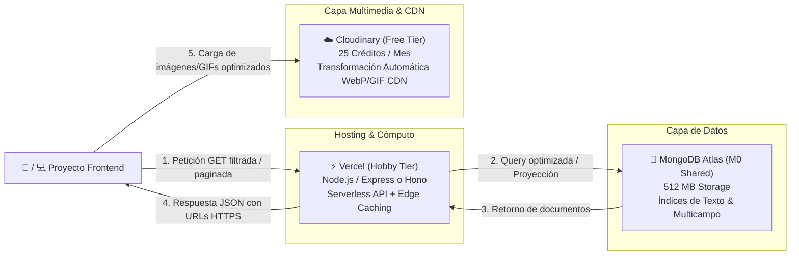
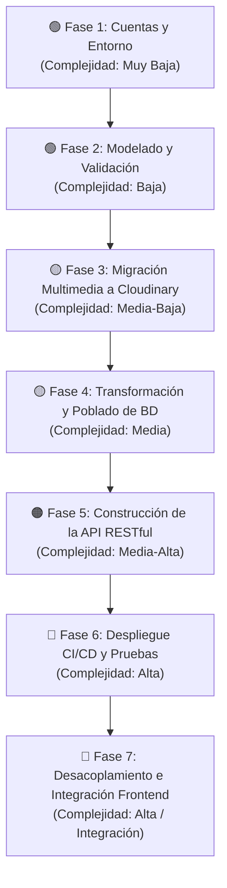

# Planificación Arquitectónica: API RESTful de Ejercicios Físicos

Este documento define la hoja de ruta técnica, arquitectura, modelo de datos, diseño de endpoints y plan de ejecución iterativo por fases para desacoplar el catálogo de ejercicios (1,324 ejercicios con 136 MB de recursos multimedia) y convertirlo en una API RESTful independiente, escalable y alojada **100% dentro de las capas gratuitas (free tiers)** más confiables del mercado.

---

## 1. Stack Tecnológico & Justificación de Free Tiers



### Tabla Resumen de Infraestructura Gratuita:

| Componente | Servicio | Capacidad Free Tier | Consumo Estimado | Justificación Técnica |
| :--- | :--- | :--- | :--- | :--- |
| **API Backend** | **Vercel** (Hobby Plan) | • 100k ejecuciones/día<br>• 100 GB ancho de banda/mes<br>• Edge Network global | < 5,000 req/día | Despliegue CI/CD instantáneo desde GitHub, serverless functions con cold start < 50ms y soporte para Edge Caching (`Cache-Control: s-maxage`). |
| **Base de Datos** | **MongoDB Atlas** (M0 Sandbox) | • 512 MB de almacenamiento<br>• Conexiones compartidas<br>• Backups automáticos | ~17 MB (JSON original) / ~4-6 MB (BSON indexado) = **< 2% del límite** | Soporta esquemas flexibles multilingües, arrays de pasos e índices de texto completo (*Full-Text Search*) para búsquedas instantáneas. |
| **Media CDN** | **Cloudinary** (Free Tier) | • 25 créditos mensuales (~25 GB de almacenamiento/ancho de banda)<br>• Transformaciones dinámicas | • 1,324 imágenes: ~11 MB<br>• 1,324 GIFs: ~125 MB<br>• Total: **136 MB (< 1% del storage)** | Optimización automática de formato y calidad (`f_auto,q_auto`), sirviendo WebP/AVIF para imágenes y compresión eficiente en GIFs. |
| **Framework** | **Node.js + Hono / Express + Zod** | Código abierto (Open Source) | N/A | Tipado estricto con TypeScript, validación de esquemas con Zod y arquitectura modular desacoplada. |

---

## 2. Modelo de Datos Optimizado

El modelo conserva la riqueza multilingüe original, añade etiquetas normalizadas (`tags`) y permite proyectar respuestas para devolver solo el idioma solicitado, reduciendo drásticamente el tamaño del payload de red (de ~15 KB a ~1.5 KB por documento).

### 2.1. Documento JSON de Ejemplo (`Exercise`)

```json
{
  "_id": "65f1a2b3c4d5e6f7a8b9c0d1",
  "id": "0001",
  "name": "3/4 sit-up",
  "category": "waist",
  "body_part": "waist",
  "target": "abs",
  "muscle_group": "waist",
  "secondary_muscles": [
    "hip flexors",
    "lower back"
  ],
  "equipment": "body weight",
  "media_id": "2gPfomN",
  "media": {
    "image_url": "https://res.cloudinary.com/tu-cloud/image/upload/f_auto,q_auto/exercises/images/0001-2gPfomN.jpg",
    "gif_url": "https://res.cloudinary.com/tu-cloud/image/upload/f_auto,q_auto/exercises/videos/0001-2gPfomN.gif"
  },
  "instructions": {
    "en": "Lie flat on the floor with your knees bent and feet flat...",
    "es": "Acuéstese en el suelo con las rodillas dobladas y los pies planos..."
  },
  "instruction_steps": {
    "en": [
      "Lie flat on the floor with your knees bent and feet flat.",
      "Place your hands lightly behind your head.",
      "Raise your torso towards your knees until 3/4 of the way up."
    ],
    "es": [
      "Acuéstese en el suelo con las rodillas dobladas y los pies planos.",
      "Coloque las manos ligeramente detrás de su cabeza.",
      "Eleve el torso hacia las rodillas hasta 3/4 del recorrido."
    ]
  },
  "tags": ["core", "abs", "no-equipment", "beginner", "waist"],
  "attribution": "Wikimedia Commons / Open Exercise DB",
  "created_at": "2024-01-01T00:00:00.000Z",
  "updated_at": "2026-09-15T00:00:00.000Z"
}
```

### 2.2. Esquema Mongoose con Índices

```typescript
import { Schema, model } from 'mongoose';

const ExerciseSchema = new Schema({
  id: { type: String, required: true, unique: true, index: true },
  name: { type: String, required: true, index: true, trim: true },
  category: { type: String, required: true, index: true },
  body_part: { 
    type: String, 
    required: true, 
    index: true,
    enum: [
      "back", "cardio", "chest", "lower arms", "lower legs", 
      "neck", "shoulders", "upper arms", "upper legs", "waist"
    ]
  },
  target: { type: String, required: true, index: true },
  muscle_group: { type: String, required: true, index: true },
  secondary_muscles: [{ type: String, index: true }],
  equipment: { type: String, required: true, index: true },
  media_id: { type: String, required: true },
  media: {
    image_url: { type: String, required: true },
    gif_url: { type: String, required: true }
  },
  instructions: { type: Map, of: String },
  instruction_steps: { type: Map, of: [String] },
  tags: [{ type: String, index: true }],
  attribution: { type: String }
}, {
  timestamps: { createdAt: 'created_at', updatedAt: 'updated_at' }
});

// Índices para búsquedas de alto rendimiento
ExerciseSchema.index({ name: 'text', target: 'text', equipment: 'text', tags: 'text' });
ExerciseSchema.index({ body_part: 1, target: 1 });
ExerciseSchema.index({ equipment: 1 });
```

---

## 3. Diseño de Endpoints RESTful

| Método | Endpoint | Parámetros (Query / Path) | Descripción |
| :--- | :--- | :--- | :--- |
| `GET` | `/api/v1/exercises` | `page` (def: 1), `limit` (def: 20, max: 100), `body_part`, `target`, `equipment`, `muscle_group`, `tag`, `lang`, `fields` | Lista paginada con filtros combinables y proyección de idioma. |
| `GET` | `/api/v1/exercises/:id` | `lang` (opcional: ej. `es`, `en`) | Obtiene un ejercicio específico por su ID único de 4 dígitos o MongoDB `_id`. |
| `GET` | `/api/v1/exercises/search` | `q` (término de búsqueda), `page`, `limit`, `lang` | Búsqueda por texto (*Full-Text Search*) sobre nombre, objetivo y equipo. |
| `GET` | `/api/v1/exercises/random` | `count` (def: 1, max: 10), `body_part`, `equipment` | Genera uno o varios ejercicios aleatorios para creadores de rutinas. |
| `GET` | `/api/v1/body-parts` | Ninguno | Retorna la lista única de partes del cuerpo disponibles. |
| `GET` | `/api/v1/targets` | `body_part` (opcional) | Retorna la lista única de músculos objetivo (`target`). |
| `GET` | `/api/v1/equipments` | Ninguno | Retorna la lista única de equipamiento requerido. |
| `GET` | `/api/v1/muscles` | Ninguno | Retorna la lista de grupos musculares primarios y secundarios. |
| `GET` | `/api/v1/health` | Ninguno | Monitoreo del estado de la API y de la conexión a la base de datos. |

---

## 4. Archivo de Configuración de Entorno (`.env.example`)

A continuación se detalla la plantilla de variables de entorno requeridas para ejecutar y desplegar el proyecto. Puedes encontrar el archivo generado en [`.env.example`](file:///Users/danielvasquez/Documents/proyectos/proyectos-html/exercises-dataset/.env.example):

```bash
# ==============================================================================
# CONFIGURACIÓN DE ENTORNO - API REST DE EJERCICIOS FÍSICOS
# ==============================================================================
# Copia este archivo como '.env' y completa los valores correspondientes.
# NUNCA subas el archivo '.env' con credenciales reales a GitHub.
# ==============================================================================

# ------------------------------------------------------------------------------
# 1. SERVIDOR Y ENTORNO
# ------------------------------------------------------------------------------
NODE_ENV=development
PORT=3000
API_PREFIX=/api/v1
CORS_ORIGIN=*

# ------------------------------------------------------------------------------
# 2. BASE DE DATOS (MONGODB ATLAS)
# ------------------------------------------------------------------------------
# URI de conexión a MongoDB Atlas (Tier M0 Free).
MONGODB_URI=mongodb+srv://<db_user>:<db_password>@<cluster-url>.mongodb.net/<database_name>?retryWrites=true&w=majority

# ------------------------------------------------------------------------------
# 3. ALMACENAMIENTO MULTIMEDIA (CLOUDINARY)
# ------------------------------------------------------------------------------
CLOUDINARY_CLOUD_NAME=tu_cloud_name
CLOUDINARY_API_KEY=tu_api_key
CLOUDINARY_API_SECRET=tu_api_secret
CLOUDINARY_URL=cloudinary://tu_api_key:tu_api_secret@tu_cloud_name
CLOUDINARY_FOLDER=exercises

# ------------------------------------------------------------------------------
# 4. CONFIGURACIÓN DE CACHÉ Y RENDIMIENTO
# ------------------------------------------------------------------------------
CDN_CACHE_TTL_SECONDS=86400
CDN_SWR_TTL_SECONDS=43200
PAGINATION_MAX_LIMIT=100
PAGINATION_DEFAULT_LIMIT=20
```

---

## 5. Plan de Ejecución Progresivo por Fases (Sprints)

Las siguientes fases están rigurosamente ordenadas de **menor a mayor complejidad técnica**, permitiendo validar cada entregable de forma incremental y sin bloqueos.



---

### Fase 1: Configuración Inicial de Cuentas y Entornos
* **Nivel de Complejidad:** Muy Baja
* **Objetivo de la fase:** Establecer la infraestructura cloud en sus tiers gratuitos, inicializar la estructura del proyecto y configurar el control de variables de entorno.

#### Pasos técnicos a realizar:
1. Crear el cluster gratuito M0 en **MongoDB Atlas** (región recomendada: `us-east-1`).
2. Configurar el usuario de base de datos y la lista blanca de acceso de red IP (`0.0.0.0/0` para permitir llamadas serverless).
3. Crear cuenta gratuita en **Cloudinary** y habilitar la carpeta raíz `exercises/`.
4. Crear cuenta en **Vercel** y vincularla con el repositorio de GitHub.
5. Crear el archivo `.env` local a partir de [`.env.example`](file:///Users/danielvasquez/Documents/proyectos/proyectos-html/exercises-dataset/.env.example).

#### Requisitos y Dependencias (Qué se necesita de tu parte):
* [ ] **Cuentas creadas:** Crear cuentas en MongoDB Atlas, Cloudinary y Vercel (si aún no las tienes).
* [ ] **Credenciales de Cloudinary:** Proveer (en tu `.env` local) `CLOUDINARY_CLOUD_NAME`, `CLOUDINARY_API_KEY` y `CLOUDINARY_API_SECRET`.
* [ ] **Cadena de conexión de MongoDB:** Proveer (en tu `.env` local) la URL de conexión `MONGODB_URI`.
* [ ] **Decisión de Repositorio:** Decidir si la API vivirá en una subcarpeta de este mismo repositorio (monorepo `api/`) o en un nuevo repositorio de GitHub independiente (recomendado: repositorio independiente para Vercel).

---

### Fase 2: Modelado de Datos y Validación de Esquemas
* **Nivel de Complejidad:** Baja
* **Objetivo de la fase:** Definir con precisión las estructuras de datos, tipos de TypeScript y validadores de entrada con Zod/Mongoose, asegurando consistencia e integridad.

#### Pasos técnicos a realizar:
1. Definir los esquemas e interfaces TypeScript para el ejercicio (`IExercise`), metadatos y respuestas paginadas.
2. Crear el esquema de validación con **Zod** para los parámetros de consulta (`query params` de filtrado y paginación).
3. Configurar el modelo de **Mongoose** con tipos estrictos y valores enumerados para `body_part`.
4. Definir las estrategias de proyección para permitir responder con un único idioma (`lang=es` o `lang=en`) sin sobrecargar el payload.

#### Requisitos y Dependencias (Qué se necesita de tu parte):
* [ ] **Decisión de idiomas prioritarios:** Confirmar si se mantienen los 10 idiomas del dataset actual (`en`, `es`, `it`, `tr`, `ru`, `zh`, `hi`, `pl`, `ko`, `fr`) o si deseas priorizar/filtrar únicamente `es` y `en`.
* [ ] **Validación del esquema:** Revisar y aprobar el esquema propuesto en la Sección 2.1 (si deseas campos adicionales como nivel de dificultad: `beginner`, `intermediate`, `advanced`).

---

### Fase 3: Scripting y Migración Multimedia a Cloudinary
* **Nivel de Complejidad:** Media-Baja
* **Objetivo de la fase:** Subir de forma automatizada y resiliente las 1,324 imágenes JPG y los 1,324 GIFs animados a Cloudinary, generando un mapa de URLs públicas optimizadas.

#### Pasos técnicos a realizar:
1. Crear un script Node.js (`scripts/migrate-media.js`) utilizando el SDK oficial de Cloudinary (`cloudinary`).
2. Implementar un gestor de concurrencia (`p-limit` con 5 a 10 hilos simultáneos) y reintentos exponenciales para prevenir fallos por saturación de red.
3. Subir las 1,324 imágenes a `exercises/images/` y los 1,324 GIFs a `exercises/videos/`.
4. Aplicar transformaciones automáticas de entrega (`f_auto,q_auto`).
5. Generar un archivo local `scripts/media_mapping.json` que relacione cada `media_id` local con sus URLs remotas en Cloudinary.

#### Requisitos y Dependencias (Qué se necesita de tu parte):
* [ ] **Archivos locales íntegros:** Tener disponibles las carpetas locales `images/` (1,324 archivos) y `videos/` (1,324 archivos) en tu máquina.
* [ ] **Credenciales válidas de Cloudinary:** Credenciales activas con cuota disponible para ejecutar la subida inicial de ~136 MB.
* [ ] **Aprobación de ejecución:** Autorización para ejecutar el script de subida masiva.

---

### Fase 4: Transformación y Poblado de Datos (Data Seeding & Indexing)
* **Nivel de Complejidad:** Media
* **Objetivo de la fase:** Cruzar el dataset original `exercises.json` con las URLs remotas generadas, enriquecer los registros e insertarlos masivamente en MongoDB Atlas con sus índices optimizados.

#### Pasos técnicos a realizar:
1. Crear el script de sembrado (`scripts/seed-database.js`).
2. Leer y parsear `data/exercises.json` (1,324 registros).
3. Cruzar cada registro con `scripts/media_mapping.json` para inyectar `media.image_url` y `media.gif_url`.
4. Generar automáticamente el array de etiquetas `tags` normalizadas por cada ejercicio.
5. Conectar con MongoDB Atlas e insertar los registros en bloques de 200 con `insertMany`.
6. Crear los índices compuestos (`body_part + target`), índice de equipo (`equipment`) e índice de texto completo (`text index`).

#### Requisitos y Dependencias (Qué se necesita de tu parte):
* [ ] **Archivo `data/exercises.json`:** Confirmar que el archivo local `data/exercises.json` es la versión final a migrar.
* [ ] **Base de Datos accesible:** Cluster de MongoDB Atlas activo con permisos de escritura para el script de sembrado.
* [ ] **Finalización de Fase 3:** Contar con el archivo `scripts/media_mapping.json` generado con éxito.

---

### Fase 5: Desarrollo de la API RESTful Serverless
* **Nivel de Complejidad:** Media-Alta
* **Objetivo de la fase:** Construir el código de la API backend con arquitectura limpia, controladores, rutas, validaciones, paginación, filtros dinámicos y cabeceras de Edge Caching.

#### Pasos técnicos a realizar:
1. Configurar la arquitectura de la aplicación en Node.js/TypeScript (con Express o Hono).
2. Implementar el módulo de conexión singleton a MongoDB con reutilización de conexiones (*cached database connection*) para evitar saturar el pool de conexiones en entornos serverless.
3. Desarrollar el `ExerciseController` y `ExerciseService` con soporte para:
   - Filtros combinados (`body_part`, `target`, `equipment`, `muscle_group`, `tag`).
   - Paginación matemática estándar (`page`, `limit`, `total_pages`, `has_next_page`).
   - Búsqueda de texto completo con `$text` y `$search`.
   - Proyección condicional por idioma (`lang`).
4. Desarrollar los endpoints de metadatos (`/body-parts`, `/targets`, `/equipments`, `/muscles`, `/random`).
5. Configurar middleware de CORS seguro y middleware de manejo global de errores.
6. Configurar cabeceras de caché HTTP (`Cache-Control: public, s-maxage=86400, stale-while-revalidate=43200`) para delegar el tráfico al CDN de Vercel.

#### Requisitos y Dependencias (Qué se necesita de tu parte):
* [ ] **Validación de rutas:** Confirmar si los nombres de endpoints propuestos en la Sección 3 cubren todos los casos de uso de tu frontend.
* [ ] **Configuración de CORS:** Indicar qué dominio o dominios tendrán permitido consumir la API (ej. `http://localhost:5173`, `https://tu-app.vercel.app`, o acceso público `*`).

---

### Fase 6: Despliegue CI/CD, Monitoreo y Pruebas de Integración
* **Nivel de Complejidad:** Alta
* **Objetivo de la fase:** Desplegar la API en producción en Vercel, configurar variables de entorno remotas y validar exhaustivamente el rendimiento y la estabilidad mediante pruebas automatizadas.

#### Pasos técnicos a realizar:
1. Crear el archivo `vercel.json` con la configuración de rutas serverless y tiempo máximo de ejecución.
2. Configurar las variables de entorno de producción en el panel de Vercel (`MONGODB_URI`, `CLOUDINARY_URL`, `CORS_ORIGIN`, etc.).
3. Realizar el primer despliegue a producción (`git push origin main` o `vercel --prod`).
4. Crear una suite de pruebas de integración / smoke tests (con Jest, Supertest o Postman Collection) para verificar:
   - Estado del endpoint de salud (`GET /api/v1/health`).
   - Paginación correcta y límites máximos.
   - Rendimiento del filtro de texto y filtros combinados.
   - Respuestas con tiempos de respuesta < 100ms en llamadas frías y < 20ms en respuestas cacheadas en CDN.

#### Requisitos y Dependencias (Qué se necesita de tu parte):
* [ ] **Vinculación en Vercel:** Importar el repositorio en tu panel de Vercel.
* [ ] **Carga de Secretos en Vercel:** Añadir las variables de entorno en el panel de Vercel Settings -> Environment Variables.
* [ ] **URL pública asignada:** Obtener la URL pública de producción generada por Vercel (ej. `https://exercises-api-iota.vercel.app`).

---

### Fase 7: Desacoplamiento y Consumo en el Frontend Principal
* **Nivel de Complejidad:** Alta / Integración
* **Objetivo de la fase:** Refactorizar el proyecto cliente para consumir la API remota, implementar optimizaciones de carga en cliente y eliminar los archivos locales pesados del repositorio.

#### Pasos técnicos a realizar:
1. Crear un servicio cliente HTTP (`exerciseApi.js` / `exerciseService.ts`) en el proyecto frontend con soporte para filtros y paginación.
2. Reemplazar la lectura estática de archivos locales por llamadas asíncronas `fetch` a los endpoints de la API.
3. Implementar carga perezosa (*Lazy Loading*) en las etiquetas de imagen (``).
4. Implementar visualización de GIFs bajo demanda (ej. cargar el GIF animado únicamente al interactuar o pasar el cursor sobre la tarjeta del ejercicio para ahorrar ancho de banda).
5. Eliminar las carpetas locales obsoletas: `images/` (11 MB), `videos/` (125 MB) y `data/` (17 MB), reduciendo el peso del repositorio principal en un **99%**.

#### Requisitos y Dependencias (Qué se necesita de tu parte):
* [ ] **Código del Frontend:** Indicar qué tecnología utiliza tu frontend actual (HTML/Vanilla JS, React, Vue, Svelte, Next.js, etc.) para proveer el snippet exacto de integración.
* [ ] **Aprobación de limpieza:** Dar confirmación final para eliminar las carpetas locales una vez validado que la API funciona correctamente en producción.

---

## 6. Estimación Final de Costos Operativos

| Servicio | Límite Free Tier Mensual | Consumo Estimado | Margen de Seguridad Libre |
| :--- | :--- | :--- | :--- |
| **MongoDB Atlas (M0)** | 512 MB | ~17 MB | **96.6% disponible** |
| **Cloudinary** | 25 GB de almacenamiento/transferencia | ~0.14 GB inicial | **99.4% disponible** |
| **Vercel Serverless** | 100,000 peticiones / día | ~2,000 peticiones / día | **98.0% disponible** |
| **Costo Total Mensual** | **$0.00 USD / mes** | **$0.00 USD / mes** | **100% Gratuito y Perpetuo** |

---

## 7. Guía de Consumo Rápido & Primeros Pasos (Demo)

**URL Base de Producción:** `https://exercises-dataset.danielvasquez.lat/api/v1`

### 7.1. Pruebas Rápidas en el Navegador
Puedes acceder directamente a cualquiera de los siguientes enlaces para visualizar las respuestas JSON:
* **Ver primeros 5 ejercicios:** [`https://exercises-dataset.danielvasquez.lat/api/v1/exercises?limit=5`](https://exercises-dataset.danielvasquez.lat/api/v1/exercises?limit=5)
* **Filtrar por pecho y mancuernas:** [`https://exercises-dataset.danielvasquez.lat/api/v1/exercises?body_part=chest&equipment=dumbbell`](https://exercises-dataset.danielvasquez.lat/api/v1/exercises?body_part=chest&equipment=dumbbell)
* **Búsqueda por texto ("squat"):** [`https://exercises-dataset.danielvasquez.lat/api/v1/exercises/search?q=squat`](https://exercises-dataset.danielvasquez.lat/api/v1/exercises/search?q=squat)
* **Ejercicio aleatorio para rutina:** [`https://exercises-dataset.danielvasquez.lat/api/v1/exercises/random`](https://exercises-dataset.danielvasquez.lat/api/v1/exercises/random)
* **Lista de grupos musculares:** [`https://exercises-dataset.danielvasquez.lat/api/v1/body-parts`](https://exercises-dataset.danielvasquez.lat/api/v1/body-parts)

---

### 7.2. Consumo en JavaScript / Frontend (`fetch`)
Snippet básico para consultar e imprimir los datos en la consola o renderizarlos en una UI:

```javascript
const API_URL = 'https://exercises-dataset.danielvasquez.lat/api/v1';

async function obtenerEjercicios(musculo = '', limite = 10) {
  try {
    const params = new URLSearchParams({ limit: limite });
    if (musculo) params.append('body_part', musculo);

    const response = await fetch(`${API_URL}/exercises?${params.toString()}`);
    const result = await response.json();

    if (result.success) {
      console.log(`Total encontrados: ${result.meta.total}`);
      result.data.forEach(ejercicio => {
        console.log(`- ${ejercicio.name} (${ejercicio.target})`);
        console.log(`  Imagen: ${ejercicio.media.image_url}`);
        console.log(`  GIF:    ${ejercicio.media.gif_url}`);
      });
    }
  } catch (error) {
    console.error('Error al consultar la API:', error);
  }
}

// Ejemplo de uso:
obtenerEjercicios('chest', 5);
```

---

### 7.3. Ejemplo de Estructura de Tarjeta Visual (HTML / React)

```html
<article class="exercise-card">
  <!-- Título y Objetivo -->
  <header>
    <h3>3/4 sit-up</h3>
    <span class="badge">Abdominales (abs)</span>
    <span class="badge">Peso corporal</span>
  </header>

  <!-- Multimedia optimizado desde Cloudinary -->
  <div class="exercise-media">
    <!-- Thumbnail ligero para vista previa -->
    
    
    <!-- Animación GIF (puede cargarse en hover o modal) -->
    
  </div>

  <!-- Instrucciones en Español -->
  <div class="instructions">
    <p>Túmbate sobre tu espalda con las rodillas flexionadas y los pies apoyados en el suelo...</p>
  </div>
</article>
```

---

### 7.4. Petición desde la Terminal (cURL)

```bash
# Consultar estado
curl -s "https://exercises-dataset.danielvasquez.lat/api/v1/health"

# Consultar ejercicios con paginación
curl -s "https://exercises-dataset.danielvasquez.lat/api/v1/exercises?limit=2" | json_pp
```

---
*Documento estructurado como guía de arquitectura técnica y planificación de sprints para la construcción de la API REST.*
